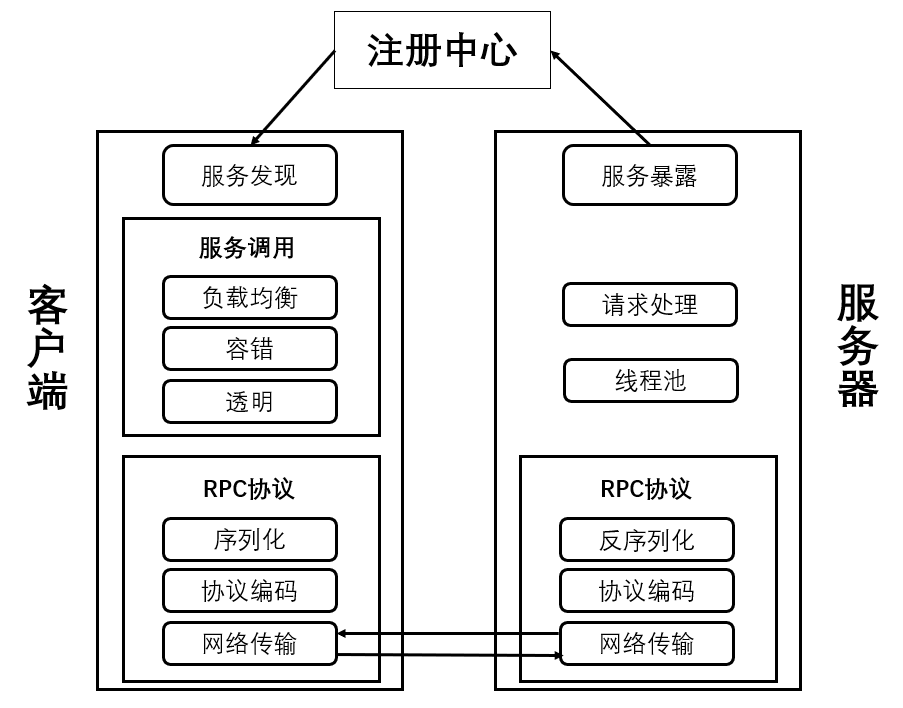

# Simple-RPC:一个简单实现的RPC框架（v1.0）
## 原理：
简单实现RPC，服务提供端 Server 向注册中心注册服务，服务消费者
Client 通过注册中心拿到服务相关信息，然后再通过网络请求服务提供端 Server。

## 实现内容：
* client 动态代理实现
* server 反射调用实现
* 其它相关工具类包括：客户端请求RpcRequest、服务器响应RpcResponse、
响应状态码ResponseCode
* 自定义服务器异常类型
* 实现服务注册表
* 实现netty传输
* 实现通用序列化接口
* 自定义传输协议
* 实现JSON序列化

## 目录结构：
* rpc-api: 服务端与客户端的公共调用接口
* rpc-common: 通用的枚举类和工具类
* rpc-core: 框架核心包括动态代理、反射调用等
* test-client: 客户端测试
* test-server: 服务器测试
